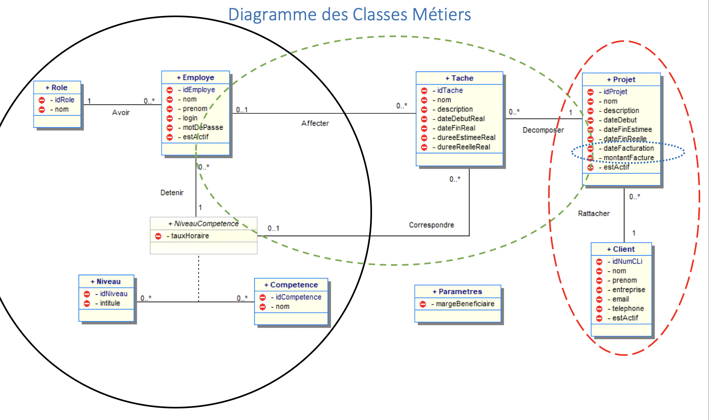

= PTUT S2 2020/2021
:icons: font

// Specific to GitHub
ifdef::env-github[]
:tip-caption: :bulb:
:note-caption: :information_source:
:important-caption: :heavy_exclamation_mark:
:caution-caption: :fire:
:warning-caption: :warning:
:graduation-icon: :mortar_board:
:cogs-icon: :writing_hand:
endif::[]

IMPORTANT: Votre projet personnel de PTUT doit se nommer `PTUTS2-2021-XYZ`.

== À propos

Ce projet est cloné automatiquement au début de votre projet de PTUT S2, il contient tous les éléments dont vous aurez besoin pour démarrer : 

- `README.adoc` : ce fichier (À modifier)
- `Evaluation` : un répertoire contenant la Grille d'évaluation et les éléments qui serviront à guider nos évaluations
- `Modeles_et_SQL` : un répertoire contenant les modèles initiaux ainsi que la documentation technique V0
- `Sujet_PJT_S2_2021.pdf` : la description du sujet
- `Prez_PJT_S2_2021.pdf` : la présentation du sujet réalisée au 1er cours de la semaine Ptut 
- `ptutDemo.jar` : un exécutable de démo 
- `Wspce_S2_PTUT.zip` : les sources de la version V0
- `Equipes_PTUT_S2_2020.pdf` : le fichier contenant les équipes

== V0

Une application fonctionnelle v0 vous est fournie sous la forme :

- d'un exécutable `RHESN_V0.jar` à la racine de votre projet
- des sources dans le répertoire `src`.

Les premiers modèles sont également disponibles dans le répertoire `doc/media/v0` :

.Diagramme de Classe de la v0

== Équipe de développement (à mettre à jour)

- Membre 1
- Membre 2
- ...

